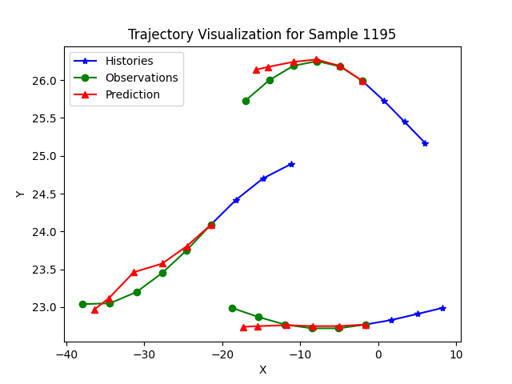

# **1 项目介绍**
***
PLM（Preference Learning Model）为预测群体骑行者轨迹而设计的一个数据驱动模型。骑行者被建模为具有异质交互策略的个体，利用偏好学习捕捉骑行者的交互策略，并基于异质性偏好组合描述群体内骑行者的交互关系，以此指导轨迹预测。

## **1.1 项目结构**
  
- main.py # 主文件
- prediction_preprocess.py # 其他工具函数
- data/ # 数据文件夹（所有数据）  
      -- data1/ # 数据文件夹（某数据）  
      -- data.csv # 原始数据
- Evaluator/ # 评估
- Example_model/ # 训练
- Processor/ # 预处理
- viz/ # 可视化
- ReadMe.md # 文档
  
  
## **1.2 数据集准备**
  
所需数据的特征值包括以下项，dome中以仙霞-剑河交叉口非机动车轨迹数据为例，
每列分别为：
1. Frame_ID
2. X[m]
3. Y[m]
4. Vx[m/s]
5. Vy[m/s]
6. Ax[m/s²]
7. Ay[m/s²]
8. Speed[km/h]
9. Acceleration[m/s²]
10. Space[m]
  
## **1.3 本地 Python 虚拟环境配置**
  
```bash
conda create --name PLM python=3.7
conda activate PLM
conda install tensorflow==2.4
conda install keras==2.3.1
conda install pillow
```
  
  
# 2 **项目流程及主程序main文件介绍**
***
包括以下功能流程：
  
- Step 1: 数据预处理
- Step 2: 构建训练数据集
- Step 3: 训练模型
- Step 4: 测试模型
- Step 5: 结果可视化
- 以上 Step 2—Step 5 可单独运行，分别采用参数 `if_const_data`、`if_train`、`if_test`、`if_vis` 分别进行控制。
- 若需要可在main.py中修改相应的参数，包括项目地址、模型参数
  
## **2.1 数据预处理**
包括建立任务文件夹和检查数据是否存在，并做数据清洗。
  
## **2.2 构建训练数据集**
```bash
from Processor import Pred_Processor
_, _, _, _, _, _ = dp.data_set_construction(train_data, 'train_set', pred_length)
```
- `Pred_Processor`类的`data_set_construction`是构造数据集的函数
  
  
  
## **2.3 模型训练**
```bash
from Example_model import Pred_model
Pred_model.motion_prediction_train(args, data_set_dir1, \  
data_set_dir2, data_set_dir3)
```
- `Pred_model`中的`motion_prediction_train`是训练模型
- `data_set_dir1`、`data_set_dir2`、`data_set_dir3`均是输入数据的地址
  
## **2.4 模型测试**
```bash
from Evaluator import Pred_Evaluator
_, _, _, ade, fde = Pred_Evaluator.trajectory_prediction\  
(args, data_set_dir1,data_set_dir2, data_set_dir3)
```
- `Pred_Evaluator`中的`trajectory_prediction`是测试函数
- `ade` 和 `fde` 为返回的测试结果
  
## **2.5 可视化**
```bash
from viz import visualization
visualization.Visualization(args,ID)
```
- `visualization`为`Visualization`中的函数
- `ID`为可视化的样本编号、可为空集
  
# **3 Demo**
***
## **3.1 指令**
```bash
# 进入目录激活环境
- cd C:\Users\YourUsername\Documents
conda activate PLM
  
# 构造数据集
python Main.py -- if_const_data True
  
# 训练
python Main.py -- if_train True
  
# 测试
python Main.py -- if_test True
  
# 可视化
python Main.py -- if_vis True
```
  
## **3.2 输出**
```bash
—————————数据预处理开始——————————
数据读取中。。。
The data has been cleaned
—————————数据预处理结束——————————
  
—————————构建数据集开始——————————
....
Train_set Processing 1/11863 (0.01%)，样本量为1个
Train_set Processing 11/11863 (0.09%)，样本量为11个
....
—————————构建数据集结束——————————
  
  
—————————训练模型开始———————————
....
Epoch 67/200
340/340 [=====] - 5s 15ms/step - loss: 0.0209 - val_loss: 0.0285
....
—————————训练模型结束———————————
  
  
—————————测试模型开始———————————
....
Progress: 0.10%
Progress: 1.09%
Progress: 2.08%
....
Prediction results saved successfully in \  
E:/ Preference_Learning_Model/data/My_Data_20240820_2/data_set/预测结果
ADE: 0.6938644935692952
FDE: 1.491244181546566
—————————测试模型结束———————————
  
——————————可视化开始———————————
Visualization....
ALL work has been done
——————————可视化结束———————————
```
  

  
  
  
  
  